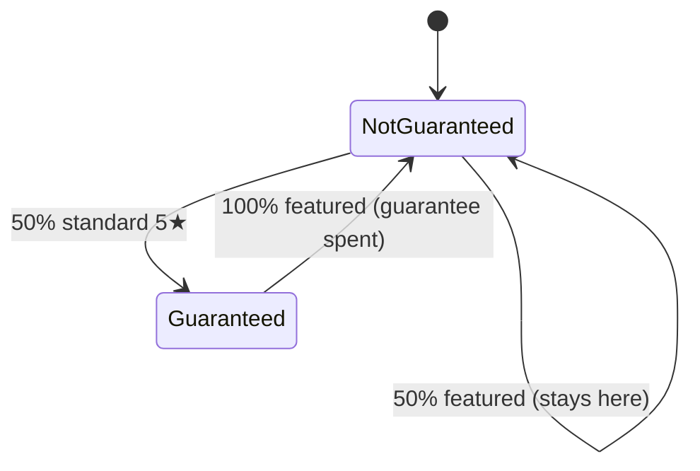
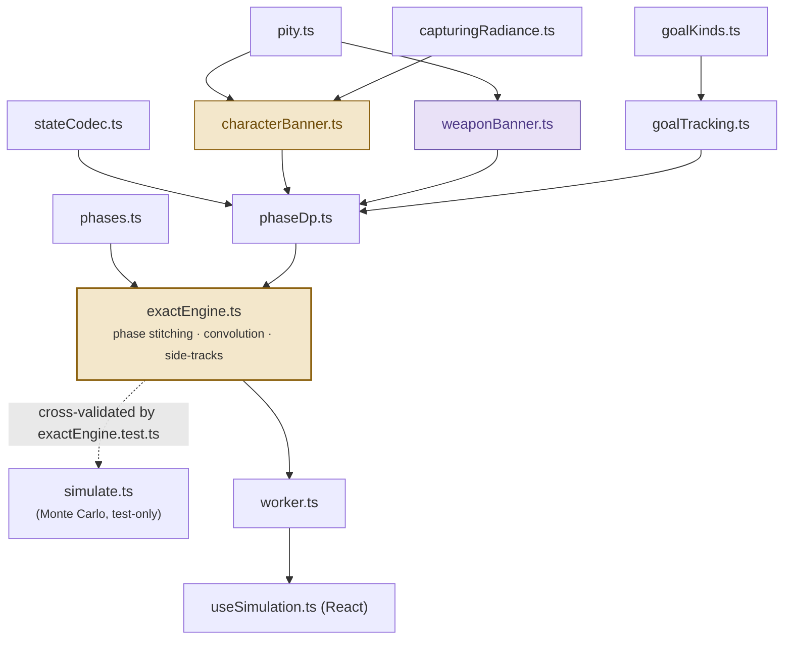

# How it all works

Everything this Genshin Impact wish calculator does — starting from what a "wish" even is, through why pity and the 50/50 exist, all the way down to the exact dynamic-programming math and convolution formulas that produce the numbers on screen. No prior familiarity with the game or the codebase assumed anywhere: read straight through, or jump to whichever part you already know.

This is a plain-Markdown copy of a longer, illustrated version published as a Claude Artifact during development — diagrams and interactive styling live only in that version, but every word of prose, every formula, and every citation below is the same. See [ARCHITECTURE.md](ARCHITECTURE.md) for the shorter, structural-only reference this document expands on, and [CHANGELOG.md](CHANGELOG.md) for the full dated history behind any specific design decision.

**Legend:** 🟡 character banner / 5★ mechanics · 🟣 weapon banner / 4★ mechanics · citations like `file.ts · name` point into the actual source.

## How to read this document

This is long on purpose — it's meant to work for a complete newcomer to Genshin's gacha system *and* for an engineer about to modify the code, without asking either one to take anything on faith. It builds in one direction: **Part I** explains the game mechanics from zero, **Part II** explains what problem the calculator is solving and why, and **Part III** derives the actual math and code that solve it — each part leans on the vocabulary the previous one built.

- **Never touched Genshin, or don't know what "pity" means?** Start at the top and read straight through.
- **Already know the game's wish system, just want to understand the app?** Skip to [Part II](#part-ii--what-the-calculator-computes-and-why).
- **Here to read or modify the code?** Skim Part I's headers for vocabulary, then go straight to [Part III](#part-iii--under-the-hood-the-exact-dp-engine). Part IV and Part V are quick-reference.

---

# Part I — The game's wish system, explained from scratch

Everything in this part is genuine Genshin Impact game mechanics — the rules this calculator's code was built to model exactly. No math yet; that's Part III. Just what actually happens when you spend currency to pull.

## I.1 What a "wish" is

In Genshin Impact, spending an in-game currency to draw a random character or weapon is called making a **wish** — everyone else calls this a gacha "pull," and this document uses the two words interchangeably. Each wish returns exactly one item, and every item has a **rarity**: 3★ (common — some minor material, not tracked as a goal by anyone), 4★ (uncommon — a real character or weapon), or 5★ (rare — the flashiest characters and weapons, and usually what people are actually chasing).

This calculator only cares about 4★ and 5★ outcomes, because those are the ones with rate-ups and pity attached. A 3★ pull is, for probability-tracking purposes, simply "nothing happened" — the underlying code literally represents it as a bare `{rarity: 3}` outcome with no further detail. `characterBanner.ts · 3★ branch`.

## I.2 The two Event Wish banners

Wishes aren't drawn from one giant pool — they're drawn from a specific **banner**, and each banner has its own currency and its own rotating lineup. This calculator covers the two "Event Wish" banners:

- **Character Event Wish** — features a rotating 5★ character and three rotating 4★ characters.
- **Weapon Event Wish** — features two rotating 5★ weapons and five rotating 4★ weapons, plus one extra mechanic unique to this banner (Epitomized Path, I.7).

On top of whatever's currently "featured" (rate-up), every banner also has a much larger **standard pool** — every other character or weapon of that rarity that's ever been added to the game, permanently available at a small background rate. This is what a "50/50" (I.4) is actually a coin flip *between*: the shiny featured item, or something at random from that large standard backlog.

## I.3 Pity: a ceiling on bad luck

If every pull's 5★ chance were a flat, tiny percentage forever, a genuinely unlucky player could in principle go hundreds of pulls without one. Genshin caps that risk with **pity**: a counter that tracks how many pulls it's been since your *last* hit of a given rarity, and quietly raises your odds the longer that streak runs — reset to zero the moment you land one. Both 5★ and 4★ have pity, tracked completely independently of each other and separately per banner.

The 5★ pity curve has three parts: a long flat stretch at a small base rate, then a "soft pity" ramp where the rate climbs fast, then a hard ceiling where a 5★ becomes mathematically guaranteed no matter what.

Concretely, on the **character banner**: every pull has a flat **0.6%** chance of a 5★ for the first 73 pulls since your last one. From pull 74 on, that chance climbs by 6 percentage points per pull. By pull 90, if you somehow still haven't hit one, the game simply guarantees it — that pull *is* a 5★, 100% of the time. The **weapon banner** runs the same shape on a shorter fuse: 0.7% base rate, soft pity starting at pull 63 (+7 points per pull), and a guaranteed 5★ by pull 77. (The in-game description says 80, but measured pull data shows the rate already reaches 100% at 77.)

4★s get the same idea on a much shorter leash — on the character banner, flat at 5.1% for 8 pulls, then a big single jump to 56.1% on the 9th pull, guaranteed by the 10th. The weapon banner's 4★s run a little hotter: 6% for 7 pulls, 66% on the 8th, guaranteed by the 9th. Because 4★s are common to begin with, most players never consciously notice this kicking in — it "catches" virtually everyone within about 9 or 10 pulls without a 4★.

*(Both curves are flat at a tiny base rate for a long stretch, then ramp steeply upward once soft pity kicks in — by design, you almost never actually feel the full brunt of the theoretical worst case, because the odds are already climbing well before the hard ceiling. Character hard pity: pull 90. Weapon hard pity: pull 80.)*

## I.4 The 50/50 and the guarantee

Landing a 5★ doesn't automatically mean you got the one advertised on the banner. On the **character banner**, when a 5★ actually lands (and you're not already owed one — see below), it's a coin flip: **50%** it's the featured character, **50%** it's a random 5★ drawn from the large standard pool (I.2) instead.

Losing that flip isn't a total loss, though — the game remembers. If your 5★ turned out to be a standard-pool character, you become **guaranteed**: the very next 5★ you pull on that banner, whenever it eventually lands, is the featured character with 100% certainty, no coin flip at all. Winning the flip (or cashing in a guarantee) resets you back to "not guaranteed," and the cycle starts over the next time a 5★ lands.



The character banner's 50/50, as a two-state loop. The weapon banner runs a friendlier **75/25** version of the exact same idea, plus one more layer covered in I.7.

## I.5 4★s play the same trick, one tier down

4★s have their own miniature version of this whole system. Each banner features a small rate-up roster at the 4★ tier too — three characters on the character banner, five weapons on the weapon banner — sitting on top of a 4★ standard pool exactly like I.2 described for 5★s. And exactly like I.4, when a 4★ lands and you're not already guaranteed, it's a coin flip between "one of the featured 4★s" and "something standard"; losing sets a guarantee for your next 4★.

The split isn't identical on both banners, though: the character banner's 4★ coin flip is a plain **50/50**, but the weapon banner's is **75/25** in the player's favor — three times more likely to land on the rate-up roster than not, even before any guarantee kicks in.

## I.6 Capturing Radiance: pity for the 50/50 itself

Players eventually noticed something odd: losing several 50/50s in a row seemed to happen less often, over huge sample sizes, than plain 50% math would predict. The working theory is that the game quietly raises your odds after repeated losses — nicknamed **Capturing Radiance**, after the in-game notification text that appears when it triggers.

HoYoverse (the game's developer) has never published the actual formula behind this, so it remains genuinely reverse-engineered community knowledge, not confirmed fact. Two competing models persist, differing in exactly when the boost kicks in and how steep it gets — this calculator lets you pick which one you trust rather than silently choosing a side. The full formulas for both are in [Part III.3](#iii3-capturing-radiance-formalized).

## I.7 Epitomized Path (weapon banner only)

The weapon banner usually features *two* 5★ weapons at once, which raises an obvious question the character banner never has to answer: if you win the 75/25, which of the two do you get? **Epitomized Path** lets you pre-select one of the two ahead of time, and tracks a "Fate Points" counter to make sure you don't get stuck: every time a 5★ weapon lands that *isn't* your selection, you earn a Fate Point; the moment you're holding one, your very next 5★ weapon is guaranteed to be your selection, 100%, overriding everything else.

This sits on top of — not instead of — the weapon banner's own 75/25 guarantee from I.5's logic (after a standard 5★ weapon, your next 5★ is guaranteed to be *one of the two* event weapons, 50/50 between them). A Fate Point fully subsumes that guarantee rather than acting alongside it: with one banked, the next 5★ is your selection regardless of what the 75/25 state currently says.

## I.8 Constellations and refinements: why duplicates matter

Pulling a character or weapon you already own is never wasted — extra copies unlock real upgrades. A character gains a **Constellation** level with each additional copy, from **C0** (just the base character, one copy) up to **C6** (seven copies total). A weapon gains a **Refinement** level the same way, from **R1** (one copy) up to **R5** (five copies total).

| copies owned | character level | weapon level |
|---|---|---|
| 1 | C0 | R1 |
| 2 | C1 | R2 |
| 3 / 4 / 5 | C2 / C3 / C4 | R3 / R4 / R5 (max) |
| 6 / 7 | C5 / C6 (max) | — |

This is exactly why a "goal" in this calculator is rarely just "get the character" — it's often "get the character to C2," which quietly means "get *three* specific copies of them," not one. The calculator always reports the full C0–C6 / R1–R5 breakdown for every named 4★, regardless of which level you actually set as your target, so you can see the whole curve at a glance.

## I.9 Patches, phases, and how a real player actually pulls

New content drops in roughly 3-week **patches**, each bringing its own featured lineup. A single patch typically runs *two* character banners at once (sharing one common trio of featured 4★ characters) alongside one weapon banner — so at any given moment there can be several banners live simultaneously, each with its own rotating cast.

A player working through a wish-list doesn't pull randomly — they rank what they want most, and pull toward their top unmet priority. But priority order isn't the whole story: while pulling toward that top goal, they might *also* pick up something else they wanted on the very same banner, purely opportunistically, without that being their main focus. This "priority order, plus opportunistic side-pickups on whatever banner is currently active" is exactly the behavior the calculator models — and grouping a goal list into stretches where one banner has the player's exclusive attention is the seed of the whole "phase" idea that Part II.4 introduces and Part III.8 formalizes.

```
Odette(char) ──────► Weapon(weapon) ──────► Alyosha(char) + Miko(char)
  Focus period 1        Focus period 2         Focus period 3 — same banner, merged
```

A priority list of "Odette, then a weapon, then Alyosha, then Miko" breaks into three focus periods — the last one covering both Alyosha and Miko together, since they're adjacent on the same banner (with Alyosha marked as featured alongside Miko — left unset, with two 5★ characters listed, she'd be "disconnected" and get a focus period of her own; see III.8). Every pull inside that last period is checked against *both* goals at once: Alyosha can pick up copies even while pulls are technically being spent chasing Miko.

---

# Part II — What the calculator computes, and why

With Part I's vocabulary in hand — pity, the 50/50, guarantees, Capturing Radiance, Epitomized Path, constellations — here's what the app actually does with it, and the core engineering problem that shapes everything in Part III.

## II.1 Inputs and outputs

You tell the calculator two things:

- **Your current state** on each banner — how deep into your current pity streak you are, whether you're already guaranteed, and (for the character banner) where your Capturing Radiance counter sits.
- **A priority-ordered goal list** — each entry names a banner, a rarity, a specific character or weapon, and, for 4★s, an optional target level (C2, R3, …) plus a couple of edge-case hints for genuinely ambiguous situations (two simultaneous banners sharing a roster, a 4★ with no clear home — Part III.7 covers exactly when these are needed).

In return, you get two things back:

- **An odds chart** — for every *prefix* of your list (just goal 1; goals 1 and 2; goals 1 through 3; …) and every pull count up to your budget, the exact probability you'll have completed that whole prefix by then.
- **A full constellation/refinement breakdown** for every named 4★ — the C0 through C6 (or R1 through R5) probability curve, in full, regardless of what level you actually set as a target.

## II.2 Why exact math, not simulation

A lot of gacha odds calculators work by **simulation**: run a few million fake pull-sequences, and count what fraction hit your goal by a given point. That's a perfectly reasonable estimate — but it *is* an estimate. Run it twice and you'll get two slightly different numbers, and that noise gets proportionally worse the rarer or deeper your target is (say, a C6 chase), since fewer of those millions of trials actually reach it.

This engine instead tracks the literal mathematical probability of every possible outcome directly, pull by pull — closer to solving the equation than to guessing-and-checking it a million times. The payoff is zero sampling noise: the number on screen isn't an estimate that would look slightly different if you asked again, it's the actual answer. The cost is entirely on the engineering side, covered in Part III: doing this exactly demands real cleverness to keep the bookkeeping small enough to run instantly in a browser tab.

## II.3 The scaling problem

Here's the obstacle. Tracking one banner's exact state — pity counters, guarantee flags, Capturing Radiance — already means juggling thousands of distinct possible situations at once (Part III.6 puts an exact number on this: 14,400 for the character banner). A goal list naming several 4★s multiplies that further, since each one's copy count is its own extra dimension to track.

Now try to track *both* banners' full state *simultaneously*, for a whole goal list, pull by pull, from the very first pull to the very last one in your budget. Those thousands-of-states-per-banner numbers multiply together into the tens of millions — technically possible to represent, but far too slow to sweep pull-by-pull in a browser tab in real time.

## II.4 The key idea: phases

The way out is the same observation I.9 already made about real players: at any given moment, only *one* banner actually matters — whichever one the player's current top unmet goal lives on. Nothing about the *other* banner's pity state is even relevant until focus eventually shifts there.

So instead of tracking both banners together for the whole goal list, the engine slices the goal list into **phases** — consecutive stretches where one banner has exclusive focus (I.9's timeline above) — solves each phase's own compact, single-banner problem on its own, and then glues the phases' results back together onto one shared pull-count axis. That gluing step is where the real mathematical machinery lives: it has to account for the fact that *when* a phase starts is itself uncertain (it depends on how the previous phase went), which turns out to be exactly the kind of question **convolution** answers. All of this — the phase-splitting rules, the compact per-phase math, and the convolution that reassembles it — is Part III.

---

# Part III — Under the hood: the exact-DP engine

Everything below is derived directly from `src/engine/`, with a citation into the exact file and function behind every formula. Each subsection opens with a plain-language recap tying it back to Part I/II before formalizing it.

## III.1 Module map

Part I explained what the rules *are*; Part II explained what problem solving them exactly runs into. This section is the map of which file implements which piece, before the next nine sections walk through them one at a time, bottom-up.



Solid arrows are real imports; the dashed line is the test-only cross-validation relationship. `simulate.ts` samples one pull at a time instead of propagating probabilities: it builds the same phases with `phases.ts`, but matches outcomes to goals with its own independent re-implementation of `goalTracking.ts`'s rules — which is why the two engines are cross-checked rather than merged.

| module | role |
|---|---|
| `pity.ts` | The piecewise pull-rate curves from Part I.3 (5★ and 4★, per banner) — pure functions of pull-count-since-last-hit. |
| `capturingRadiance.ts` | Part I.6's two competing hypotheses for the post-loss-streak boost, formalized. |
| `characterBanner.ts` / `weaponBanner.ts` | Exhaustive (probability, outcome, next state) branch lists for one pull — Part I.4–I.7's rules, as code. |
| `stateCodec.ts` | Packs a banner state into one integer, for array indexing instead of hashing. |
| `goalKinds.ts` | Per-kind rules shared by the engine and UI: copies needed for a C/R level, default levels, labels, anchor limits. |
| `goalTracking.ts` | The phase-local vs. persistent goal-progress state machine, shared by both engines. |
| `phases.ts` | Pure function of the goal list alone: groups goals into phases (Part II.4's idea, formalized). |
| `phaseDp.ts` | The exact DP for one phase — the "slice" restructuring lives here. |
| `exactEngine.ts` | The live runtime engine: convolves phases together into the app's actual odds chart. |

## III.2 Pity curves, formalized

This is Part I.3's rate chart, written as exact piecewise functions of $n$, the 1-indexed pull count since the last hit of that rarity. `pity.ts` — four pure functions, nothing stateful; every other module calls these with whatever counter it's tracking.

**Character 5★ rate** (`pity.ts · char5Rate`):

$$
p_5^{char}(n) = \begin{cases} 0.006 & n \le 73 \\ 0.006 + 0.06(n-73) & 74 \le n \le 89 \\ 1 & n \ge 90 \end{cases}
$$

Worked example: on your 81st pull without a 5★, your chance *that pull* is:

```
char5Rate(81) = 0.006 + 0.06 × (81 − 73)
              = 0.006 + 0.06 × 8 = 0.486   // 48.6%, up from a 0.6% base rate
```

**Weapon 5★ rate** (`pity.ts · weapon5Rate`) — a shorter, steeper ramp: soft pity starts at 63 and a 5★ is certain by 77 (the in-game text says 80; measured data from GGanalysis says 77), thirteen pulls earlier than the character banner's 90.

$$
p_5^{weapon}(n) = \begin{cases} 0.007 & n \le 62 \\ 0.007 + 0.07(n-62) & 63 \le n \le 76 \\ 1 & n \ge 77 \end{cases}
$$

**4★ rates** (`pity.ts`'s `char4Rate` / `weapon4Rate`) — a single-value jump, not a ramp, then flat certainty: on the character banner the jump is at pull 9 with certainty from 10; the weapon banner's base rate is higher (6.0%, the official figure, vs 5.1%) and it jumps one pull earlier. This flatness is what licenses capping the stored `pity4` digit at 9 in the state encoding (III.6): once $n\ge10$ neither rate ever changes again, so nothing distinguishes $n=10$ from $n=11$.

$$
p_4^{char}(n) = \begin{cases} 0.051 & n \le 8 \\ 0.561 & n = 9 \\ 1 & n \ge 10 \end{cases} \qquad p_4^{weapon}(n) = \begin{cases} 0.06 & n \le 7 \\ 0.66 & n = 8 \\ 1 & n \ge 9 \end{cases}
$$

## III.3 Capturing Radiance, formalized

Part I.6 introduced Capturing Radiance as "the game boosts you after repeated 50/50 losses, unofficially." Here are both community models exactly as implemented, `capturingRadiance.ts` — a 4-valued counter $r \in \{0,1,2,3\}$ that resolves every character-banner 50/50, `resolve50_50(r)`, called only when you're not already guaranteed, i.e. only on a "real" coin flip.

**Hypothesis A — default.** Boost applies only from $r=2$ on. A win at $r=0$ or $r=1$ is always "normal" and resets fully; a win at $r=2$ or $r=3$ decrements to **1, not 0** — the counter never fully clears once boosted odds have actually paid out.

| r | on win | on loss |
|---|---|---|
| 0 | 0.5 → win_normal, r→0 | 0.5 → loss, r→1 |
| 1 | 0.5 → win_normal, r→0 | 0.5 → loss, r→2 |
| 2 | min(0.5,w) normal + (w−min(0.5,w)) CR, r→1 | 1−w → loss, r→3 |
| 3 | 1.0 → win_capturing_radiance, r→1 | — |

$w$ = `r2TotalWinRate`, default **0.55**, user-adjustable — the *total* win probability at $r=2$, split into an organic 50% "normal" portion and a $w-0.5$ "Capturing Radiance" portion once $w>0.5$. `capturingRadiance.ts · hypothesisA`. Worked example: after two straight 50/50 losses (arriving at $r=2$ for your third 5★ this streak), your win chance jumps from the base 50% to the full 55% — 50 points "normal" plus a 5-point Capturing Radiance kicker. Cross-checked against the community project HuTaoSite's independent implementation.

**Hypothesis B — flatter curve, earlier onset:**

$$
\text{win\_rate}(r) = 0.5 + 0.5 \cdot c_r, \quad c \in \{0,\ 0.05,\ 0.5,\ 1\} \tag{1}
$$

So win rates are exactly **{50%, 52.5%, 75%, 100%}** for $r=0\ldots3$. Any win — at any $r$ — resets fully to 0; a loss advances $r$ by 1, capped at 3. `capturingRadiance.ts · hypothesisB`.

> **Not collapsed into one "true" model.** The two hypotheses are kept genuinely separate throughout the engine rather than averaged or defaulted silently — the uncertainty here is real, not an engineering shortcut. Hypothesis A is the endorsed default, confirmed to match community 4M-pull analyses and the app author's own long-standing mental model.

## III.4 Character banner — per-pull transition

This is Part I.4 and I.5's rules — the 50/50, the guarantee, the 4★ mini-guarantee — turned into one exhaustive function. `characterBanner.ts`'s `transitionCharacterBanner(state, config, crModel, crParams)` takes a state `(pity5, guaranteed5, crCounter, pity4, guaranteed4)` and returns every `(probability, outcome, nextState)` branch for one pull, summing to exactly 1. This is the single source of truth the DP sweeps over — no separate "compute the probability" path exists anywhere else.

Let $p_5$ = char5Rate(pity5+1), $p_4$ = char4Rate(pity4+1). The pull resolves in strict priority: 5★ first, then 4★ conditional on no 5★, then 3★/nothing conditional on neither.

**5★ branch — mass $p_5$** (`characterBanner.ts · 5★ branch`):

$$
\begin{aligned}
\text{guaranteed}_5 = \text{true} &:\quad p_5 \to \text{featured 5★},\ \ \text{guaranteed}_5' = \text{false} \tag{2}\\[4pt]
\text{guaranteed}_5 = \text{false} &:\quad p_5 \cdot \pi(t) \to \{\text{win}\to\text{featured},\ \text{loss}\to\text{standard}\} \text{ per CR transition } t \tag{3}
\end{aligned}
$$

On a loss, `guaranteed5'` becomes true (the classic 50/50-loss guarantee). Either way `pity5'` resets to 0, and the Capturing Radiance counter carries forward exactly as `resolve50_50` returned it.

Worked example: pull 81, not guaranteed, hypothesis A at $r=0$. $p_5$ = 48.6% (III.2's calculation above). That mass splits down the middle: 24.3% this exact pull is the featured 5★, 24.3% it's a standard 5★ (and you become guaranteed), and the remaining 51.4% isn't a 5★ at all this pull.

**4★ branch — mass $(1-p_5)\cdot p_4$** (`characterBanner.ts · 4★ branch`). Reached only on the complementary event "not a 5★ this pull." Mirrors the 5★ branch's own guarantee structure one rarity tier down (Part I.5):

$$
\begin{aligned}
\text{guaranteed}_4 = \text{true} &:\quad \text{split evenly over } n \text{ featured 4★ ids, each gets } (1-p_5)p_4 / n \tag{4}\\[4pt]
\text{guaranteed}_4 = \text{false} &:\quad 0.5\text{ win (split } n \text{ ways)} + 0.5\text{ loss} \to \text{standard},\ \text{guaranteed}_4' = \text{true} \tag{5}
\end{aligned}
$$

$n$ = `config.featured4StarIds.length` — always padded to **3** real-or-placeholder slots per phase (III.8), matching the real 3-character rate-up roster from Part I.5.

**Remainder — mass $(1-p_5)(1-p_4)$** (`characterBanner.ts · 3★ branch`). A plain 3★/nothing pull: `pity5' = pity5+1`, `pity4' = min(pity4+1, 9)`, every guarantee flag unchanged.

## III.5 Weapon banner — per-pull transition

This formalizes Part I.5 and I.7: the weapon banner's own 75/25, and Epitomized Path's Fate Points layered on top of it. No Capturing Radiance here (character-banner-only). State is `(pity5, guaranteed5, fatePoints, pity4, guaranteed4)`.

Let $p_5$ = weapon5Rate(pity5+1), $p_4$ = weapon4Rate(pity4+1). The 5★ branch is a three-way priority cascade (`weaponBanner.ts · 5★ branch`):

$$
\begin{aligned}
\text{fatePoints} = 1 &:\quad p_5 \to \text{chosen weapon (100\%)},\ \text{fatePoints}' = 0 \tag{6}\\[4pt]
\text{fatePoints} = 0,\ \text{guaranteed}_5 = \text{true} &:\quad 0.5p_5 \to \text{chosen},\ \ 0.5p_5 \to \text{other (fatePoints}'=1) \tag{7}\\[4pt]
\text{fatePoints} = 0,\ \text{guaranteed}_5 = \text{false} &:\quad 0.375p_5 \to \text{chosen},\ \ 0.375p_5 \to \text{other},\ \ 0.25p_5 \to \text{standard} \tag{8}
\end{aligned}
$$

A fate point **fully overrides** the guarantee (6) regardless of what `guaranteed5` holds — it doesn't act "within" the 75/25, it subsumes it entirely, exactly as Part I.7 described. In the organic 3-way roll (8), landing on *standard* sets both `guaranteed5' = true` *and* `fatePoints' = 1` — a standard 5★ pays out a fate point too, since it "isn't the chosen weapon" exactly as much as the other event weapon is. Every branch resets `pity5' = 0`.

> **Why the 37.5/37.5/25 split is invisible mid-phase.** A standard-5★ roll (8) grants a fate point in the *same* pull that would otherwise need it — so within one phase, whether that pull happened via (7) or (8) has no observable difference going forward. It only becomes observable across a phase boundary: `fatePoints` resets to 0 for a new weapon-banner phase (a fresh Epitomized Path selection) while `guaranteed5` carries over — so the new phase's first 5★ is a fresh 50/50 between its own chosen/other identities, informed by a guarantee earned under the old phase's completely different selection.

**4★ branch — mass $(1-p_5)\cdot p_4$** (`weaponBanner.ts · 4★ branch`):

$$
\begin{aligned}
\text{guaranteed}_4 = \text{true} &:\quad \text{split evenly over } n \text{ featured 4★ weapon ids} \tag{9}\\[4pt]
\text{guaranteed}_4 = \text{false} &:\quad 0.75\text{ win (split } n \text{ ways)} + 0.25\text{ loss} \to \text{standard},\ \text{guaranteed}_4' = \text{true} \tag{10}
\end{aligned}
$$

Note the split: **75/25**, as Part I.5 described, not the character banner's 50/50 — confirmed against an independent implementation. $n$ is padded to **5** slots, matching the real weapon-banner roster.

## III.6 State encoding

Part II.3 mentioned "14,400 distinct states" for the character banner without justifying it — here's where that number comes from, and how the engine represents it cheaply. `stateCodec.ts` packs every banner state into one non-negative integer via mixed-radix encoding, so it can key a dense array or a `Map<number, probability>` directly, with no hashing and no decode step needed for equality.

For digit radices $(d_0, d_1, \ldots, d_{n-1})$ most-significant first, encoding is Horner's method — the same trick as reading a multi-digit number left to right, one digit at a time:

$$
\text{code} = \sum_i v_i \cdot \prod_{j>i} d_j \;=\; (\ldots((v_0 \cdot d_1 + v_1)\cdot d_2 + v_2)\ldots)\cdot d_{n-1} + v_{n-1} \tag{11}
$$

and decoding peels off digits from the *least*-significant end via repeated mod/div — exactly like reading off a base-10 number's digits with `%10` and `/10` repeatedly, just with a different radix per digit position instead of a constant 10. `stateCodec.ts`'s generic `encodeVector`/`decodeVector` (also reused by the goal-tracking vectors, III.7) implement exactly this.

| banner | digit order (most→least significant) | modulus |
|---|---|---|
| character | pity5(90) × guaranteed5(2) × crCounter(4) × pity4(10) × guaranteed4(2) | 14,400 |
| weapon | pity5(77) × guaranteed5(2) × fatePoints(2) × pity4(10) × guaranteed4(2) | 6,160 |

Worked example (character banner): pity5=5, guaranteed5=false, crCounter=1, pity4=3, guaranteed4=false.
`code = (((5×2+0)×4+1)×10+3)×2+0 = ((10×4+1)×10+3)×2 = (41×10+3)×2 = 413×2 = 826` — one integer, unambiguously reversible back to those five original numbers.

`pity4` is capped at 9 by both transition functions — **lossless**, since the 4★ rate is flat at 100% for any $n \ge 10$ (III.2), so no future rate lookup can ever distinguish 9 from any larger value. `pity5` needs no such cap: it's naturally bounded by each banner's own hard pity (90 / 77). Without the `pity4` cap the encoding would be unbounded, since a long run of consecutive 5★ pulls can in principle push the 4★ counter arbitrarily high while never triggering a 4★-rate lookup that would reveal it's overflowed.

**The persistent goal-tracking vector reuses the same technique**, but its `dims` array is *derived from the goal list*, not a fixed constant: one radix-2 slot per distinct `5star_weapon` target id (obtained / not), then one slot per named 4★ goal sized `maxCopies+1` — **8** for character (C0–C6, i.e. 0–7 copies, Part I.8) and **6** for weapon (R1–R5, 0–5 copies). This is exactly why `PersistentSpec` isn't appendable (III.7): adding a goal changes the `dims` array itself, not just what's stored at an existing index.

## III.7 Goal tracking state machine

This is where "a priority-ordered goal list" (Part II.1) turns into actual tracked state. `goalTracking.ts` keeps two tracking vectors with genuinely different lifetimes, both encoded via III.6's mixed-radix scheme, both carried alongside the banner state through the DP.

| vector | lifetime | tracks |
|---|---|---|
| `phaseVector` (`PhaseLocalSpec`) | resets every phase | a single FIFO counter (0…count) over this phase's own `5star_character` goals, in priority order |
| `persistentVector` (`PersistentSpec`) | carries across every phase of a banner | `5star_weapon` obtained-flags + `4star_character`/`4star_weapon` copy counts, built once from the whole goal list |

The split exists because character-banner 5★ matching is **identity-agnostic** — the game's banner config tracks only one currently-featured id at a time, so a second `5star_character` goal in your list means "whoever's featured on some future rerun," not a different named person, and the earliest pending goal in the current phase's FIFO claims each win. 4★s and 5★-weapons, by contrast, are **identity-specific**: several coexist on one banner's roster simultaneously and are matched by exact item id, so their progress must survive exactly as long as they can still opportunistically drop — which, per the anchoring rules below, can span more than one phase.

**A worked example: when does a same-phase 4★ actually stop accruing?** Say your goal list is **Odette (5★) → Alyosha (4★) → Miko (5★)**, all on the character banner, with Odette and Miko close enough in priority that they end up in the same phase. Suppose Alyosha can be featured alongside *either* of them (both are candidate "anchors" for her). Two configurations behave very differently:

- **Alyosha anchored to both Odette and Miko:** she accrues copies through the entire phase — before Odette drops, after Odette drops, all the way through Miko. The moment Odette is won, the very next featured win is free to claim Miko immediately, even if Alyosha hasn't hit her own target copy count yet. Nothing about her holds up Miko's own claim.
- **Alyosha anchored to Odette only:** the instant Odette is won, if Alyosha hasn't yet reached her target, the *next* featured win is **not** allowed to advance to Miko — it's absorbed as just another copy of Odette (and, incidentally, another chance for Alyosha to accrue). Only once Alyosha finally hits her target does a featured win start counting toward Miko. Once focus does move to Miko, Alyosha's window closes for good — she can no longer accrue, even opportunistically.

So the same numerical goal list can produce genuinely different odds for Miko, depending purely on which 5★s a same-phase 4★ is said to be "riding along with." This is the single trickiest gate in the whole engine, and it's exactly what the next two formulas encode.

**Same-phase 5★ blocking** — `isNextFiveStarClaimBlocked` (`goalTracking.ts · isNextFiveStarClaimBlocked`):

$$
\text{blocked} \iff \exists\ 4\bigstar\ g \text{ in this phase}:\ \text{nextGoalId} \notin \text{anchors}(g)\ \land\ \text{every other anchor}(g)\text{ already resolved}\ \land\ \text{copies}(g) < \text{target}(g)+1 \tag{12}
$$

This single predicate is what makes "Alyosha anchored to Odette only" behaviorally different from "Alyosha anchored to both" — without it, the two configurations above would be numerically indistinguishable.

**Window opening** — `isFourStarWindowOpenInPhase` (`goalTracking.ts · isFourStarWindowOpenInPhase`). The current "focus rank" within a phase is `phaseVector[0]+1` (the next unclaimed rank) — unless (12) is blocking it, in which case focus is still pinned to the *last claimed* rank. A same-phase-anchored 4★ only accrues copies while the current focus rank is one of its own anchors — so a 4★ anchored to a phase's *later* 5★ does not start accruing from pull 1 just because it shares the phase; it waits until focus genuinely reaches that rank.

**Cross-phase closing** — `computeClosedFourStarGoalIdsForPhase`. For phase index $p$ and a persistent 4★'s anchor phase range $[\min, \max]$:

$$
\text{closed}(p) \iff p < \min \ \lor\ (p > \max \land p \ne \text{natal phase}) \tag{13}
$$

$p < \min$: none of the anchors have happened yet, so this item structurally isn't on phase $p$'s real-world rate-up roster at all. $p > \max$: every anchor is guaranteed already resolved (a phase can't graduate without its own goals — anchors included — being satisfied), *except* the 4★'s own natal phase (the one it sits in), which stays open regardless of where it falls relative to its anchors — e.g. a phase that exists only to chase her after a detour (see III.8's `resolveFourStarBlockingPhase`).

## III.8 Phase decomposition

This formalizes Part II.4's "phases" idea and Part I.9's timeline example. `phases.ts`'s `buildPhases(goals)` — a pure function of the goal list alone, never of pull budget. Banner focus is defined as "the banner of the highest-priority incomplete goal," which depends only on the fixed priority order, not on completion timing — so focus only ever changes at a phase boundary, and a maximal run of consecutive same-banner goals is one phase, with two carve-outs.

**Two carve-outs to "adjacent same banner = same phase":**

- **5★-weapon adjacency is not enough.** Two adjacent `5star_weapon` goals only merge into one phase when explicitly linked (`linkedWeaponGoalId`, mutual) — meaning "same real Epitomized Path window" (Part I.7). Unlinked-but-adjacent means two separate, sequential real phases.
- **5★-character adjacency is not enough either.** Two adjacent `5star_character` goals only merge when explicitly linked (`linkedCharacterGoalId`) — meaning "two genuinely simultaneous banners" (Part I.9's "two character banners at once"). Otherwise, a run of sequential 5★s (each its own later patch) forces a phase boundary between each pair.

A third rule, layered on top as a post-processing split rather than woven into the same pass (to avoid accidentally re-merging an unrelated later goal): a **disconnected** 4★ — no coherent anchor to any listed 5★ window, either an explicit empty `anchoredFiveStarGoalIds: []` or an ambiguous `undefined` with 2+ candidate windows — always becomes the sole member of its own isolated phase, at its own priority-list position.

**Resolving a 4★'s real blocking phase.** A 4★'s own textual position in the goal list ("natal phase") can differ from the phase whose graduation it actually gates:

$$
\text{blockingPhase}(g) = \begin{cases} \text{natalPhase}(g) & \text{if natalPhase}(g) \in \text{anchors}(g) \\ \max\big(\text{natalPhase}(g),\ \max\{\text{phase}(a) : a \in \text{anchors}(g)\}\big) & \text{otherwise} \end{cases} \tag{14}
$$

**Never the anchor alone, and never unconditionally the latest anchor either.** When a 4★'s own natal phase genuinely is one of her named anchors, she blocks *there* — holding up that phase's own graduation, just like any native member would — rather than always deferring to whichever anchor happens to be latest. Only when the natal phase isn't a real anchor window for her at all does she become a non-blocking "passenger," riding through phases before her true anchor's phase — accruing copies without holding anything up — while her real completion odds are computed against the phase that actually gates her (`phases.ts · resolveFourStarBlockingPhase`). This is also the mechanism that feeds the "side-track" bridging in III.10 — a 4★ whose blocking phase differs from every phase it textually sits inside needs its own resolution machinery, since no single phase's `localPrefixDone` array can already know about it.

> **Why this needed a second fix alongside it.** Blocking on the natal phase only solves half of it. Say Odette and Miko are explicitly **linked** (Part I.9's "simultaneous banners") but split apart by an interleaved weapon-banner detour, and a 4★ is anchored to both. Once Odette's own phase correctly holds open past her claim (per (14) above), an *extra* featured win landing during that hold-up has nowhere to go — Odette's own phase only knows about Odette's own rank, and Miko lives in a completely separate `Phase` object. A real player would expect that extra win to roll over onto Miko's still-open slot, not vanish. III.10's "character window" mechanism is the other half of this fix — see there for how the phase-local FIFO code survives exactly this kind of detour.

## III.9 The per-phase exact DP

Part II.4 promised that each phase gets "its own compact, single-banner problem." This is that problem, solved. `phaseDp.ts`'s `runPhaseDp` — given a normalized starting distribution over (banner substate, persistent vector, phase-local FIFO code), propagates probability mass pull by pull until either the phase's blocking goals are all satisfied (mass "graduates" into `exitSubstateDist`) or the phase's local pull budget is exhausted.

**State space.** Three coordinates travel together: the banner substate code $b$ (III.6, bounded — 14,400 or 6,160 values), the persistent code $c$ (goal copies/flags, banner-wide), and the phase-local code $f$ (the same-phase 5★ FIFO counter from III.7 — reset to 0 on entry, except across a split linked window, III.10). A pair $(c,f)$ is called a **slice**; each slice owns one dense `Float64Array` indexed by $b$.

**The factorization that makes it tractable.** A pull's effect on $(c,f)$ — via `updateGoalTracking`/`isGoalDone` — depends **only on which outcome shape occurred** (rarity + kind + item id), never on $b$. The banner-transition side (III.4/III.5) depends only on $b$. So for a fixed slice, the (small, fixed) set of possible outcome shapes $\Omega$ — always exactly 7 (character banner: 4 base shapes + 3 padded 4★-character slots) or 10 (weapon banner: 5 base shapes + 5 padded 4★-weapon slots), from `enumerateOutcomeShapes` — has its goal-tracking result computed **once**, then every $b$ in that slice just looks the result up and does array arithmetic:

$$
M_{l+1}[b'; c',f'] \mathrel{+}= \sum_{\substack{(b,\omega):\ \tau_B(b,\omega)=b',\\ \tau_G(c,f,\omega)=(c',f')}} M_l[b;\,c,f]\cdot\pi(b,\omega) \tag{15}
$$

where $\tau_B(b,\omega)$ is the banner's own next-state function and $\tau_G(c,f,\omega)$ is goal-tracking's — the two never interact. Before this restructuring, every $(b,c,f)$ triple re-derived the goal-tracking result independently; since $b$ ranges over thousands of values, that repeated the same handful of possible results thousands of times over. This is documented as the single biggest performance lever in the engine — the difference between "solves instantly" and "times out," for the exact same math. `phaseDp.ts · runPhaseDp`.

Picture two example "slices," each a dense array over banner substate — a 4★-featured outcome moves every cell in slice one to the same new $(c',f')$ in slice two (computed once per slice per outcome shape, then applied as array arithmetic), while a different outcome instead satisfies every phase goal and exits that cell's mass to `exitSubstateDist`. That's the entire point of the slice restructuring: one slice's goal-tracking transition is computed once and then swept across every banner substate as pure array arithmetic.

**What each phase reports:**

| field | meaning |
|---|---|
| `blockingPrefixDone[l]` | cumulative mass where the phase's *blocking* goals (III.8's `resolveFourStarBlockingPhase`-derived set, not always literal `phaseGoals`) are all satisfied by local pull $l$ |
| `localPrefixDone[k][l]` | P(phaseGoals[0..k] all done by $l$) — active mass still meeting that condition, plus graduated mass that met it on the way out |
| `graduatedPrefixDone[k][l]` | just the graduated-only component of the row above — needed to keep active vs. graduated mass separable across phases (below) |
| `active/graduatedLevelCounts[fi][level][l]` | P(persistent 4★ `fi` has > level copies by $l$), split by whether that mass is still active in this phase or has already graduated out of it |

The active/graduated split for 4★ breakdowns exists because `exactEngine.ts` must combine them differently across a banner's phases: active contributions from *every* phase are summed (that mass hasn't left the banner), but only the *last* phase's graduated contribution gets added directly — an earlier phase's graduated mass flows into the next phase via `exitSubstateDist` and becomes that phase's own active mass, so re-adding it would double-count it (III.10's "in-transit" bridging handles the gap between).

## III.10 Stitching phases together

Part II.4 called this "the real mathematical machinery," because a phase's own local pull-count axis (III.9) starts over at 0 every time, but the chart the user actually sees needs one shared, global pull axis. `exactEngine.ts`'s `runExactSimulation` — the live runtime engine — is where every phase's output gets aligned onto that global axis, and where a banner's substate is handed off from one phase to its next reoccurrence.

**The convolution primitive.** Here's the plain-language version first: imagine you don't know exactly when a phase will start — maybe it starts on global pull 3, maybe pull 8, maybe pull 20, each with some probability, because it depends on how the *previous* phase happened to go. Once it does start, you separately know its own *local* progress curve — "given I just started, here's my chance of being done after $l$ more pulls." To get the true global chance of being done by pull $N$, you add up, over every possible start time $t$, "the chance it started at exactly $t$" times "the chance it then finished within the remaining $N-t$ pulls." That sum-over-every-possible-start-time is exactly what **convolution** means:

$$
\text{convolve}(\text{density}, \text{cumMetric})[N] = \sum_{t=0}^{N} \text{density}[t] \cdot \text{cumMetric}[N-t] \tag{16}
$$

`exactEngine.ts · convolve`. One function, two uses: (a) aligning a phase's own local cumulative metric onto the global axis, weighted by *when* the phase was actually entered; (b) advancing the running **arrival density** itself — the distribution over "phase $p+1$ is entered at exactly global pull $\tau$" — by convolving two independent waiting-time distributions, exactly the standard fact that the sum of two independent nonnegative random variables has a pmf equal to the convolution of their own pmfs.

**Handoff on banner reoccurrence.** When a later phase reuses a banner, its `startDist` is the earlier phase's own `exitSubstateDist`, **normalized** (divided by its own total mass) — a conditional distribution: *given* this phase eventually graduates within its own local horizon, what's the substate distribution at the moment it does. Weapon Fate Points are reset to 0 on this handoff unless the reoccurring phase's own weapon goal is explicitly linked to the one it's carrying over from (III.8) — a genuinely continuous Epitomized Path window, not a new selection.

> **Where the documented time-marginalization residual comes from.** This normalization step is exact for the arrival-time distribution itself, but it applies *one averaged* substate distribution uniformly regardless of *when* a given trial actually graduated. That's fine when nothing extends a phase past its natural pity/CR reset point — but a phase-extending mechanism (a same-phase-anchored 4★ still accruing after its 5★ is claimed) skews the graduating population toward early-finishing, atypical-pity-state trials. Measured up to ~8 percentage points in adversarial deep-target-4★-compounding cases — accepted as a known architectural limitation (Part IV), not fixed. The same averaging affects the constellation/refinement breakdown for a 4★ still on the roster across several phases of her banner — up to ~8pp in the levels above her target against Monte Carlo. (It used to reach ordinary lists too, through the trailing continuation and frozen 4★s' hand-offs; both are now computed without a hand-off — see below.)

**The side-track mechanism.** III.8's $\text{blockingPhase}(g) > \text{natalPhase}(g)$ case — a non-blocking 4★ riding through earlier phases before its own gating phase — needs its own bridging, because no single phase's `localPrefixDone` already accounts for it. The engine maintains **two parallel density streams** alongside the main arrival density, from the goal's natal phase through to its blocking phase:

$$
\begin{aligned}
\text{gDoneCum}[n] &= \text{convolve}(\text{density}, \text{graduatedPrefixDone}[k])[n] \tag{17}\\
\text{blockingCum}[n] &= \text{convolve}(\text{density}, \text{blockingPrefixDone})[n] \tag{18}\\
\text{gPendingCum}[n] &= \max(0,\ \text{blockingCum}[n] - \text{gDoneCum}[n]) \tag{19}
\end{aligned}
$$

`gDoneDensity` = "reached this point in the chain, and the goal is *already* individually done"; `gPendingDensity` = "the phase moved on, but the goal is still pending." Every intervening phase's own series entries use `gDoneDensity` in place of the main arrival density — crediting only the already-satisfied stream — while both streams advance forward together through each intervening phase exactly like the main arrival density does (16). At the goal's own blocking phase, the pending stream resolves against the goal's *own* completion alone — not the whole blocking condition:

$$
\text{resolved}[n] = \text{withinNatalContribution}[n] + \text{convolve}(\text{gPendingDensity},\ \text{activeLevel}+\text{graduatedLevel})[n] \tag{20}
$$

Using `blockingPrefixDone` here instead — which requires the *whole* blocking condition, e.g. the phase's own native 5★ too — was exactly the twentieth reported bug: a side-tracked 4★'s own odds came out wrongly identical to "4★ AND everything else the blocking phase needs." `exactEngine.ts · goalAloneDoneCumulative`. This construction is exact for one simultaneously-active side track; a second overlapping one falls back to a documented, more conservative marginal-subtraction approximation, guarded by a monotonicity clamp (below).

**The character-window mechanism: carrying a FIFO code across a detour.** III.8's revised (14) means Odette's own phase can now legitimately run past Odette's own claim — held open by a same-window 4★ still short of target. If Odette and Miko (her other anchor) are explicitly linked but split into separate phases by an interleaved detour, an extra featured win landing during that hold-up needs somewhere to go: it should roll over onto Miko's still-open slot, not vanish as "this phase hasn't been reached yet." Doing that exactly means the phase-local FIFO code itself — not just banner substate and the persistent vector — has to survive the handoff across the detour, something §III.9's slices never needed before (the FIFO always reset to 0 on phase entry).

`phases.ts`'s `computeCharacterWindowPartnerPhase`/`computeCharacterWindowGoalsForPhase` find such a pair (mirroring the weapon-window search pattern from §III.5 — `computeWeaponWindowGoalsForPhase` — but solving a different problem: a weapon pull's identity is directly observable, so it never needed a FIFO at all). Both phases of the pair get their `PhaseLocalSpec` built from this *same*, combined, priority-ordered goal list — call it `effectivePhaseGoals` — instead of each one's own native members, so their phase-local codes share one compatible encoding:

$$
\text{exitKey} = (\text{bannerCode} \cdot \text{persistentModulus} + \text{persistentCode}) \cdot \text{phaseModulus} + \text{phaseCode} \tag{21}
$$

`exitSubstateDist`/`startDist` keys are **always** this 3-part form now (previously 2-part, phase code implicitly reset to 0) — costing nothing for an ordinary phase, since its own native 5★s always block it, pinning `phaseCode` to one fixed value at the point of graduation regardless of whether the encoding carries a slot for it. What changes is purely which of two things `exactEngine.ts` does on a same-banner reoccurrence: for an ordinary phase, decode out just `(bannerCode, persistentCode)` and re-seed `phaseCode` at 0 (the standing behavior — a later phase's 5★ is normally a genuinely separate win); for the *second* phase of a character-window pair, preserve the decoded `phaseCode` unchanged, letting the earlier phase's mid-detour progress carry straight through.

**In-transit graduated mass, and the trailing continuation.** A 4★'s breakdown must keep reporting an already-obtained copy even while focus has moved to a different banner mid-chain — otherwise it would vanish from the chart for the whole intervening stretch. For a non-last-usage phase, its graduation-time density is convolved forward and held as "in transit" until the banner's own next phase starts. The detour can be more than one phase long (two unlinked weapon goals are two consecutive weapon phases), so the gap's duration density is the convolution of every intervening phase's completion density, and the held copies count against that whole gap's *survival* function (1 − its CDF): a copy still counts for as long as the detour hasn't finished.

Once the *literal last* phase graduates with budget remaining, a real player keeps pulling on that same banner rather than stopping outright. So that phase's own DP runs a **trailing continuation**: mass that graduates moves into continuation slices that keep pulling, with the last phase's 4★ roster as the pool, letting a 4★ on that roster keep accruing bonus copies past her own target. Running it inside the same DP — rather than as a separate phase seeded from the normalized exit distribution, as an earlier version did — keeps each graduate's copies tied to *when* it graduated; the averaged version was 5–10pp off in the levels above a target. A 4★ whose window closed earlier isn't on this roster, so she stays frozen — and her breakdown is taken straight from her last open phase's graduated mass rather than through later phases' hand-offs, for the same reason. Continuation mass stops pulling after local pull 400 of the last phase (`MAX_CONTINUATION_HORIZON_PULLS`) — a small, user-approved plateau that bounds the cost, since continuation slices never graduate out the way an ordinary phase's mass does.

**Monotonicity clamp.** A forward pass at the very end enforces `series[k] ≤ series[k−1]` pointwise — prefix $k$ is a strictly harder requirement than prefix $k-1$, so it can never show a higher probability. This is proven exact for a non-blocking goal's own resolved position, but only a conservative *upper bound* for later positions in the rare two-simultaneous-non-blocking-goals fallback case, where the true joint distribution between the two goals' completions isn't tracked directly. `exactEngine.ts · monotonicity clamp`.

---

# Part IV — Known limitations

Deliberate, measured tradeoffs — not oversights. Each was investigated, quantified, and accepted by explicit decision rather than silently shipped. Every one below is small enough to be invisible in ordinary use, and only shows up in specific, named configurations.

> **crCounter / persistent-vector time-marginalization.** Derived above (III.10) — up to ~8 percentage points in adversarial deep-target-4★-compounding cases (a goal list chasing a high constellation on a 4★ that keeps riding through several phases of the same banner). In the constellation/refinement breakdown it reached ordinary lists too (5–10pp above a 4★'s target) until the trailing continuation moved inside the last phase's DP and frozen 4★s stopped going through hand-offs (2026-09-24); it now remains only for a 4★ still on the roster across several phases of her banner (up to ~8pp above target, measured against Monte Carlo). A real fix means re-running a downstream phase separately per arrival-time/state bucket instead of from one merged distribution — a substantial architectural change, deliberately not attempted.

> **Pull-budget-decrease slicing residual.** `sliceResult.ts`'s cache-and-slice (truncating a cached larger-budget result instead of a fresh recompute, so lowering your pull budget in the UI feels instant) is exact only when no banner is reused across phases in a way that changes the implicit "graduated within N pulls" conditioning — reachable whenever a banner is reused across phases. Measured worst case ≈0.0007 percentage points — about three orders of magnitude below display precision. Accepted universally.

> **Pull-budget increases are a full recompute, not a resume.** A "naive resume" design (extend each phase's own DP state, never retroactively refresh a downstream phase's already-fixed `startDist`) was directly measured at a 10–38 percentage point residual in an adversarial case — 1,000–50,000× larger than the slicing residual above, since a chain of same-banner phases compounds each hop's own conditioning error into the next. Abandoned after a full plan-mode design pass and direct measurement — raising your pull budget always triggers a fresh, fully exact recompute instead.

> **PersistentSpec is banner-wide, not phase-scoped.** A 4★ goal whose value froze after its own phase graduated still rides along as a live dimension in every later phase of that banner's state space — root cause of the low per-banner goal-count ceiling (`MAX_TOTAL_FOUR_STAR_GOALS_PER_BANNER` = 3 character / 4 weapon; this is why the app limits how many 4★ goals you can name on one banner). Making this phase-scoped is a substantially larger project than any single fix here, and hasn't been attempted — it's also why "cheap incremental goal-add" isn't feasible without deep rework, since `dims` is derived from the whole goal list up front.

---

# Part V — Running it locally

Client-side only, no backend. Vite + React + TypeScript, Vitest for tests.

```bash
## install once
npm install
```

| command | what it does |
|---|---|
| `npm run dev` | start the Vite dev server |
| `Ctrl+C` | stop it — in the terminal that's running `npm run dev` |
| `lsof -ti:5173 \| xargs kill` | stop it if it was launched detached/in the background instead (no foreground terminal to Ctrl+C) |
| `npm run build` | type-check (`tsc -b`) then production build |
| `npm run test` / `npx vitest run` | run the full suite |
| `npx vitest run <pattern>` | run one file, e.g. `npx vitest run exactEngine` |
| `npx tsc -b` | type-check only, no build |
| `npm run lint` | oxlint |

> **Slow tests.** Some tests in `exactEngine.test.ts` run full exact-DP computations and carry explicit multi-second per-test timeouts — running the whole suite in parallel with other files can push them close to that budget. Give any similarly expensive new test a generous explicit timeout rather than relying on the default.

**Where the tests live — `src/engine/__tests__/`:**

| file | what it checks |
|---|---|
| `exactEngine.test.ts` | exact engine vs. Monte Carlo (`simulate.ts`) agreement |
| `invariants.test.ts` | logical relationships within the exact engine alone (e.g. "a wider anchor window can only help") — catches a conceptual error shared by both engines, which cross-validation alone can't |
| `oddsAudit.test.ts` | broad, non-pinned cross-validation sweep over deliberately varied combined scenarios |
| `trace.survey.test.ts` / `trace.test.ts` | narrated pull-by-pull playthroughs — "why does the engine believe this," run with `--reporter=verbose` to read the log |
| `phases.test.ts`, `goalTracking.test.ts`, `goalValidation.test.ts`, `characterBanner.test.ts`, `weaponBanner.test.ts`, `capturingRadiance.test.ts`, `pity.test.ts` | focused unit tests per module |
| `sliceResult.test.ts` | pull-budget-decrease cache correctness, including its own known-tiny-residual case |

---

Derived directly from `src/engine/` — every formula above cites the exact file it comes from. See [ARCHITECTURE.md](ARCHITECTURE.md) for the structural/conceptual prose reference this expands on, and [CHANGELOG.md](CHANGELOG.md) for the full dated history behind any specific design decision.
